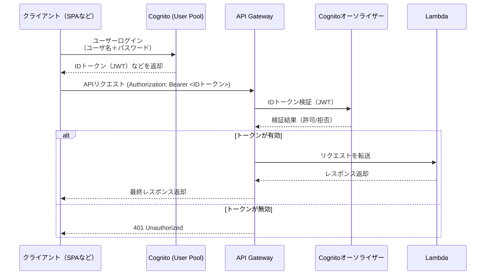

# Chapter4

```bash
npm install --save-dev esbuild@0
npm install @aws-sdk/client-dynamodb

npx cdk synth
npx cdk deploy
```

## 補足

`lib/lambda-ddb-chapter4-stack.ts`のファイルは書籍中のLambda+DynamoDB部分までの実装だけを抜き出しています。

## 参考図

以下は書籍内で利用したシーケンス図です。


